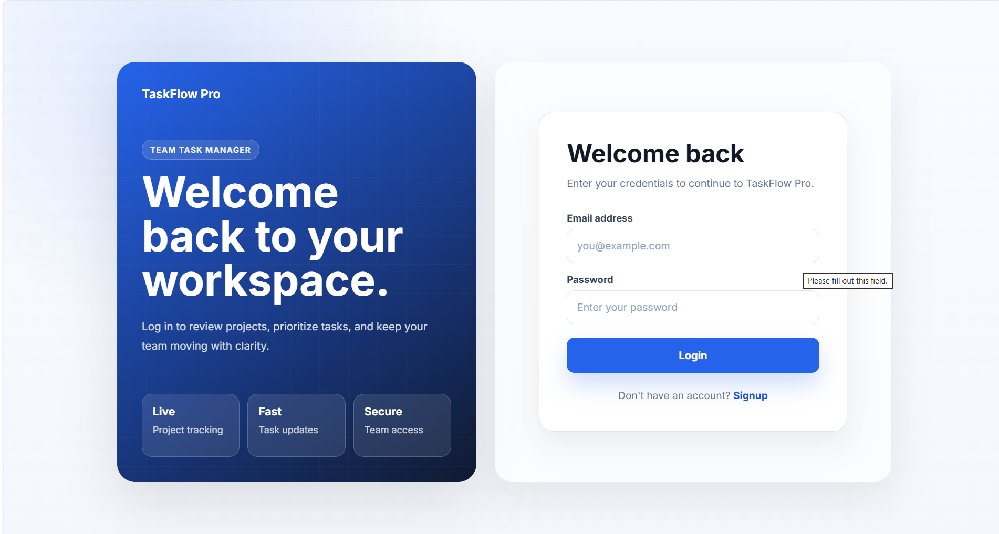
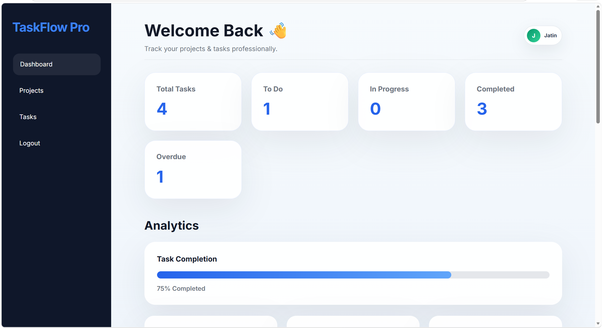
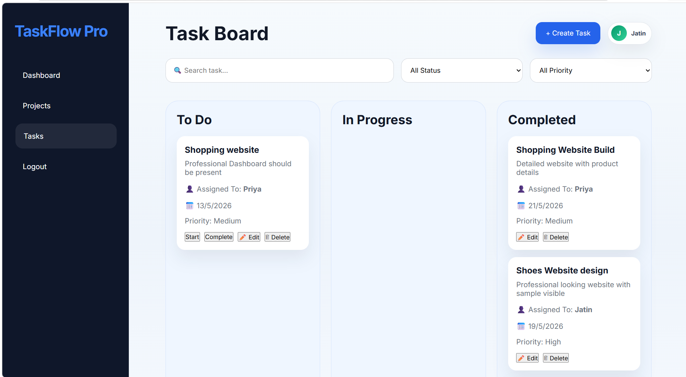

---
# 🚀 TaskFlow Pro – Team Task Manager

A modern **Team Task Management Web Application** designed to help teams efficiently manage projects, tasks, deadlines, and collaboration in one place.

🌐 **Live Demo:**  
https://tiny-macaron-722df8.netlify.app/

📂 **GitHub Repository:**  
https://github.com/JatinWadhwani123/team-task-manager

---

## 📌 About The Project

**TaskFlow Pro** is a full-stack web application that allows users to:

- Create and manage projects
- Assign and track tasks
- Manage team workflow
- Secure authentication system
- Monitor project progress
- Organize work efficiently

The project is built using **HTML, CSS, JavaScript, Node.js, Express.js, MongoDB**, and deployed using **Netlify + Railway**.

---

## ✨ Features

### 🔐 Authentication System
- User Signup
- User Login
- Secure JWT Authentication
- Protected Routes
- User Session Management

### 📁 Project Management
- Create New Projects
- View Existing Projects
- Manage Project Details
- Project Dashboard

### ✅ Task Management
- Create Tasks
- Assign Tasks
- Update Task Status
- Track Progress
- Organize Team Workflow

### 📊 Dashboard
- Clean User Interface
- Project Overview
- Task Monitoring
- Productivity Tracking

### 🌍 Deployment
- Frontend deployed on **Netlify**
- Backend deployed on **Railway**
- MongoDB Database Connected

---

## 🛠️ Tech Stack

### Frontend
- HTML5
- CSS3
- JavaScript (Vanilla JS)

### Backend
- Node.js
- Express.js

### Database
- MongoDB
- MongoDB Atlas

### Authentication
- JWT (JSON Web Token)

### Deployment
- Netlify (Frontend)
- Railway (Backend)

### Version Control
- Git
- GitHub

---

## 📂 Project Structure

```bash
team-task-manager/
│── backend/
│   ├── config/
│   ├── controllers/
│   ├── middleware/
│   ├── models/
│   ├── routes/
│   ├── server.js
│   ├── package.json
│
│── frontend/
│   ├── css/
│   ├── js/
│   ├── pages/
│   ├── index.html
│
│── README.md
````

---

## ⚙️ Installation & Setup

Follow these steps to run the project locally.

### 1️⃣ Clone Repository

```bash
git clone https://github.com/JatinWadhwani123/team-task-manager.git
```

### 2️⃣ Navigate to Project

```bash
cd team-task-manager
```

---

## 🔧 Backend Setup

### Go to Backend Folder

```bash
cd backend
```

### Install Dependencies

```bash
npm install
```

### Create `.env` File

Create a `.env` file inside the backend folder and add:

```env
PORT=5000
MONGO_URI=your_mongodb_connection_string
JWT_SECRET=your_secret_key
```

### Start Backend Server

```bash
npm start
```

Server will run on:

```bash
http://localhost:5000
```

---

## 🎨 Frontend Setup

Open the frontend folder:

```bash
cd frontend
```

Run using **Live Server** in VS Code
or simply open:

```bash
index.html
```

---

## 🔗 API Endpoints

### Authentication APIs

#### Signup

```http
POST /api/auth/signup
```

#### Login

```http
POST /api/auth/login
```

---

## 🌐 Deployment

### Frontend Deployment

Deployed on **Netlify**

🔗 Live Website:
[https://tiny-macaron-722df8.netlify.app/](https://tiny-macaron-722df8.netlify.app/)

### Backend Deployment

Deployed on **Railway**

---

## 📸 Screenshots

### 🏠 Home Page


---

### 🔐 Login Page




---

### 📊 Dashboard



---

### ✅ Task Management



---

## 🔒 Environment Variables

The following environment variables are required:

```env
MONGO_URI=
JWT_SECRET=
PORT=
```

---

## 🚀 Future Improvements

* Team Collaboration Features
* Real-Time Notifications
* File Upload Support
* Role-Based Access Control
* Dark Mode
* Advanced Analytics Dashboard
* Task Priority Management
* Due Date Reminders

---

## 🤝 Contributing

Contributions are welcome!

If you want to improve this project:

1. Fork the Repository
2. Create a New Branch

```bash
git checkout -b feature-name
```

3. Commit Changes

```bash
git commit -m "Added new feature"
```

4. Push Changes

```bash
git push origin feature-name
```

5. Create Pull Request

---

## 🐛 Bug Reporting

Found a bug?

Please open an issue here:

[https://github.com/JatinWadhwani123/team-task-manager/issues](https://github.com/JatinWadhwani123/team-task-manager/issues)

---

## 📄 License

This project is licensed under the **MIT License**.

---

## 👨‍💻 Developer

**Jatin Wadhwani**

GitHub:
[https://github.com/JatinWadhwani123](https://github.com/JatinWadhwani123)

---

## ⭐ Support

If you found this project helpful, please consider giving it a **star ⭐ on GitHub**.

It helps motivate further improvements 🚀

```

After adding this:

1. Open GitHub repo  
2. Click **README.md** → Edit  
3. Paste everything  
4. Commit changes

Your repo will look much more professional.
```
